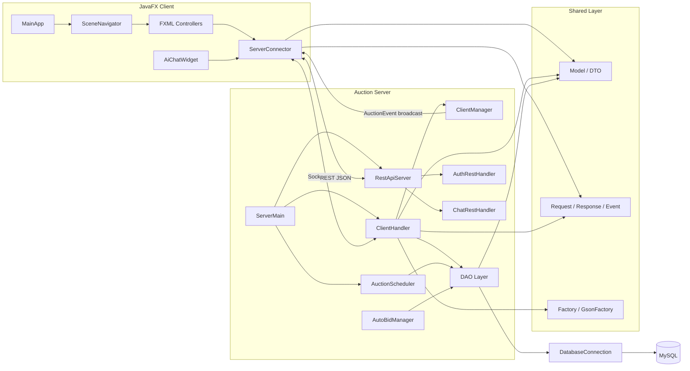

# Online Auction System

Online Auction System là ứng dụng đấu giá trực tuyến viết bằng Java 17. Dự án gồm client JavaFX, server socket xử lý nghiệp vụ đấu giá thời gian thực, REST API cho đăng nhập/chatbot, tầng DAO làm việc với MySQL và các lớp shared dùng chung cho model, DTO, network message, factory và observer.

## Mục Lục

- [Tính năng chính](#tính-năng-chính)
- [Kiến trúc tổng quan](#kiến-trúc-tổng-quan)
- [Công nghệ sử dụng](#công-nghệ-sử-dụng)
- [Cấu trúc thư mục](#cấu-trúc-thư-mục)
- [Điều kiện tiên quyết](#điều-kiện-tiên-quyết)
- [Cài đặt và cấu hình](#cài-đặt-và-cấu-hình)
- [Chạy ứng dụng](#chạy-ứng-dụng)
- [Tài khoản mẫu](#tài-khoản-mẫu)
- [Kiểm thử](#kiểm-thử)
- [Tài liệu dự án](#tài-liệu-dự-án)
- [Thành viên thực hiện](#thành-viên-thực-hiện)

## Tính Năng Chính

- Đăng ký, đăng nhập và quản lý phiên đăng nhập.
- Dashboard hiển thị các phiên đấu giá theo danh mục và trạng thái.
- Đăng bán sản phẩm và tự động tạo phiên đấu giá.
- Phòng đấu giá thời gian thực qua socket.
- Đặt giá thủ công, đấu giá tự động và lịch sử đặt giá.
- Chống sniping bằng cách gia hạn phiên khi có lượt bid sát giờ kết thúc.
- Theo dõi phiên đã tham gia, phiên của tôi, lịch sử đấu giá, giỏ hàng và thanh toán.
- Thông báo cho người thắng, người bán và người dùng bị quá hạn thanh toán.
- Trang quản trị để quản lý người dùng và phiên đấu giá.
- Chatbot hỗ trợ người dùng qua REST API.

## Kiến Trúc Tổng Quan



Ứng dụng dùng kiến trúc phân lớp:

- `client`: giao diện JavaFX, điều hướng màn hình và gọi server.
- `server`: xử lý socket, REST API, xác thực, lịch đấu giá và nghiệp vụ.
- `server.dao`: đóng gói thao tác SQL với MySQL.
- `shared`: model, DTO, factory, network message, observer và Gson adapter dùng chung.

## Công Nghệ Sử Dụng

- Java 17
- JavaFX 17
- Maven
- MySQL 8
- Gson 2.10.1
- JUnit 5
- Java HTTP Server (`com.sun.net.httpserver`)
- Gemini API cho chatbot hỗ trợ người dùng

## Cấu Trúc Thư Mục

```text
Online_Auction_System/
├── database/
│   ├── init.sql
│   └── migrate.sql
├── docs/
│   ├── OOP_IN_PROJECT.md
│   ├── UML_CLASS_DIAGRAM.md
│   └── rest-ai-chatbot.md
├── src/
│   ├── main/
│   │   ├── java/com/auction/
│   │   │   ├── client/
│   │   │   ├── server/
│   │   │   └── shared/
│   │   └── resources/views/
│   └── test/java/com/auction/
├── pom.xml
└── README.md
```

## Điều Kiện Tiên Quyết

Trước khi chạy dự án, cần chuẩn bị:

- JDK 17 hoặc mới hơn.
- Maven 3.8 hoặc mới hơn.
- MySQL 8 hoặc tương thích.
- Git nếu muốn clone và quản lý source.
- Biến môi trường `GEMINI_API_KEY` nếu muốn dùng chatbot bằng API key riêng.

## Cài Đặt Và Cấu Hình

1. Clone hoặc mở dự án:

   ```powershell
   git clone <repository-url>
   cd Online_Auction_System
   ```

2. Tạo database:

   ```powershell
   mysql -u root -p < database/init.sql
   mysql -u root -p online_auction < database/migrate.sql
   ```

3. Cấu hình kết nối database nếu không dùng mặc định:

   ```powershell
   $env:AUCTION_DB_URL="jdbc:mysql://127.0.0.1:3306/online_auction?useSSL=false&allowPublicKeyRetrieval=true&serverTimezone=Asia/Ho_Chi_Minh"
   $env:AUCTION_DB_USER="root"
   $env:AUCTION_DB_PASSWORD="your-password"
   ```

4. Cấu hình port nếu cần:

   ```powershell
   $env:AUCTION_SERVER_PORT="8080"
   $env:AUCTION_REST_PORT="8081"
   $env:AUCTION_SERVER_HOST="127.0.0.1"
   ```

5. Cấu hình chatbot:

   ```powershell
   $env:GEMINI_API_KEY="your-api-key"
   $env:GEMINI_MODEL="gemini-2.5-flash"
   ```

Không commit API key, mật khẩu database hoặc thông tin cá nhân vào repository.

## Chạy Ứng Dụng

Chạy server trước:

```powershell
mvn exec:java -Dexec.mainClass="com.auction.server.ServerMain"
```

Chạy client JavaFX ở terminal khác:

```powershell
mvn javafx:run
```

Các port mặc định:

- Socket server: `8080`
- REST API: `8081`
- Database: `online_auction`

## Tài Khoản Mẫu

Nếu dùng `database/init.sql`, có thể đăng nhập bằng dữ liệu mẫu:

| Vai trò | Username | Password |
| --- | --- | --- |
| Admin | `admin` | `123456` |
| User | `seller1` | `123456` |
| User | `bidder1` | `123456` |

Trong hệ thống hiện tại, tài khoản có role `ADMIN` hoặc `USER`; vai trò trong phòng đấu giá như `SELLER` và `BIDDER` được lưu tại bảng `auction_participants`.

## Kiểm Thử

Chạy toàn bộ test:

```powershell
mvn test
```

Các nhóm test hiện có bao phủ factory, hashing mật khẩu, session registry, profile DAO, bid DAO và auto-bid manager.

## Tài Liệu Dự Án

- [UML Class Diagram](docs/UML_CLASS_DIAGRAM.md): sơ đồ lớp, thuộc tính, phương thức và quan hệ giữa các lớp.
- [OOP In Project](docs/OOP_IN_PROJECT.md): giải thích kiến thức OOP và cách áp dụng trong hệ thống.
- [REST Login And AI Chatbot](docs/rest-ai-chatbot.md): mô tả REST login, socket auth và chatbot.

Tài liệu README này được viết theo các ý chính thường có trong README tốt: tên dự án, mô tả, yêu cầu, cài đặt, cách sử dụng, kiểm thử, tài liệu tham khảo và thông tin nhóm.

## Thành Viên Thực Hiện

- Lê Khánh Huyền: lập trình và thiết kế UI/UX Login, Register.
- Trần Ngọc Hà: lập trình và thiết kế UI/UX Dashboard.
- Nguyễn Bá Kỳ: lập trình và thiết kế chức năng Auction.
- Trần Quốc Hưng: backend, database, networking, xử lý client-server và logic nghiệp vụ.

## Tài Liệu Tham Khảo

- [Biểu đồ lớp UML - Viblo](https://viblo.asia/p/bieu-do-lop-uml-Az45bDaVZxY)
- [Cách viết README chất - Viblo](https://viblo.asia/p/cach-viet-readme-chat-LzD5dr9EZjY)
