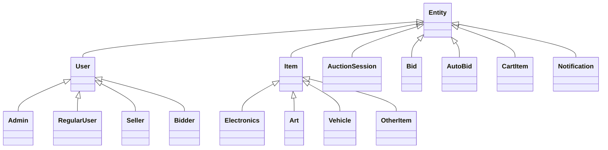
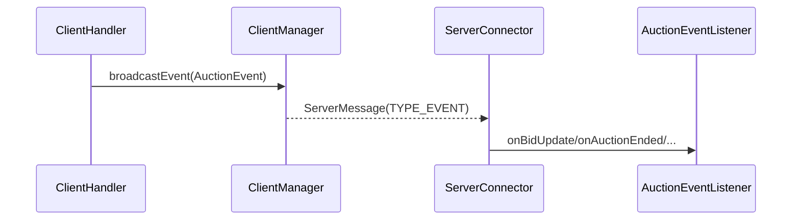
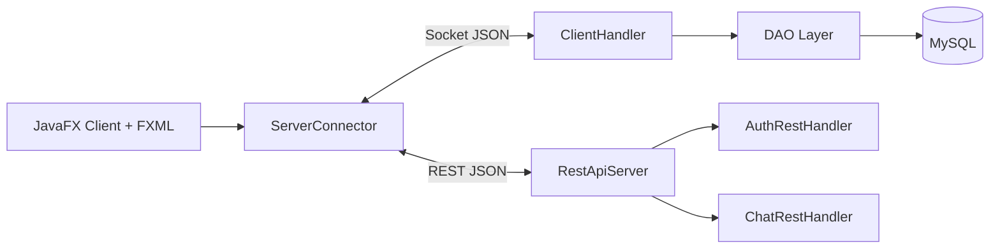
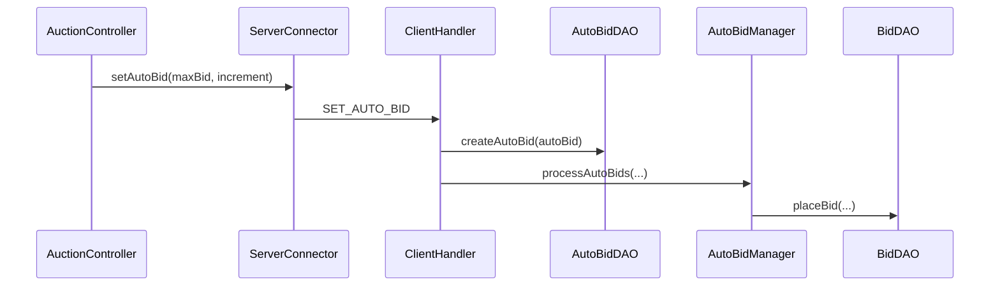

# OOP Trong Online Auction System

Tài liệu này tổng hợp kiến thức OOP cần nắm để bảo vệ bài tập lớn "Phát triển hệ thống đấu giá trực tuyến". Nội dung được đối chiếu với đề bài trong file `2026-Bài tập lớn (1).pdf` và mã nguồn hiện tại của dự án.

## 1. Phân Tích Đề Bài

Đề bài yêu cầu xây dựng hệ thống đấu giá trực tuyến bằng Java, có giao diện GUI, có kiến trúc client-server, có xử lý nghiệp vụ đấu giá và phải thể hiện rõ năng lực thiết kế hướng đối tượng.

Các nhóm yêu cầu chính:

| Nhóm yêu cầu | Nội dung đề bài | Mức độ trong dự án |
| --- | --- | --- |
| Quản lý người dùng | Đăng ký, đăng nhập, vai trò Bidder, Seller, Admin | Có `LoginController`, `RegisterController`, `User`, `Admin`, `RegularUser`, `AuctionParticipantDAO`, `SessionRegistry` |
| Quản lý sản phẩm | Thêm, sửa, xóa sản phẩm; tên, mô tả, giá khởi điểm, giá hiện tại, thời gian | Có `Item`, `Electronics`, `Art`, `Vehicle`, `OtherItem`, `ItemDAO`, `AuctionSession` |
| Tham gia đấu giá | Đặt giá cao hơn giá hiện tại, kiểm tra hợp lệ, cập nhật người dẫn đầu | Có `Bid`, `BidDAO.placeBid()`, `AuctionController`, `ClientHandler.handlePlaceBid()` |
| Kết thúc phiên | Tự động đóng phiên, xác định winner, trạng thái `OPEN -> RUNNING -> FINISHED -> PAID / CANCELED` | Có `AuctionScheduler`, `AuctionSessionDAO`, `CartDAO`, `AuctionStatus` |
| Xử lý lỗi | Giá thấp, phiên đóng, lỗi dữ liệu, lỗi kết nối | Có validate ở `BidDAO`, `ClientHandler`, `ServerConnector`, `DatabaseConnection` |
| GUI | JavaFX/Swing, danh sách phiên, chi tiết sản phẩm, đấu giá realtime, quản lý sản phẩm | Dùng JavaFX + FXML: `Dashboard.fxml`, `AuctionRoom.fxml`, controllers |
| Auto-bidding | `maxBid`, `increment`, so sánh nhiều auto-bid, không vượt max | Có `AutoBid`, `AutoBidDAO`, `AutoBidManager` |
| Concurrent bidding | Tránh lost update, rollback, race condition, hai người cùng thắng | Có transaction và `SELECT ... FOR UPDATE` trong `BidDAO.placeBid()` |
| Anti-sniping | Bid trong X giây cuối thì gia hạn Y giây | Có logic gia hạn 30 giây cuối thêm 60 giây trong `ClientHandler.handlePlaceBid()` |
| Realtime update | Observer/Socket/Event-based, không polling liên tục | Có `AuctionEvent`, `AuctionEventListener`, `ClientManager`, `ServerConnector` |
| Biểu đồ giá | Line chart giá đấu theo thời gian | Có `LineChart` trong `AuctionController` |
| OOP | Lớp chính, kế thừa, đóng gói, đa hình, trừu tượng | Có `Entity`, `User`, `Item`, factory, observer interface |
| Kiến trúc | Client-server, JSON, MVC, chỉ server truy cập DB | Có JavaFX client, socket/REST server, DAO, MySQL |
| Triển khai | Maven/Gradle, clean code, JUnit, GitHub Actions | Có `pom.xml`, JUnit tests, `.github/workflows/maven.yml` |

Điểm cần nói trong vấn đáp: đề gợi ý lớp `Auction` và `BidTransaction`; trong dự án, nhóm hiện thực tương ứng bằng `AuctionSession` và `Bid`. Đây là đổi tên hợp lý vì `AuctionSession` nhấn mạnh một phiên đấu giá có vòng đời và thời gian, còn `Bid` biểu diễn một giao dịch đặt giá.

## 2. Kiến Thức OOP Cần Nắm

### 2.1. Class Và Object

Class là bản thiết kế, object là thể hiện cụ thể của class.

Trong dự án:

- `User` là class mô tả người dùng nói chung.
- Một tài khoản cụ thể đăng nhập vào hệ thống là object của `Admin` hoặc `RegularUser`.
- `Item` là class trừu tượng mô tả sản phẩm đấu giá.
- Một sản phẩm "iPhone 15 Pro Max" có thể là object của `Electronics`.
- `AuctionSession` là object biểu diễn một phiên đấu giá cụ thể với `startTime`, `endTime`, `status`.

### 2.2. Attribute Và Method

Attribute lưu trạng thái của object, method mô tả hành vi của object.

Ví dụ:

- `Bid` có attribute `auctionId`, `userId`, `bidAmount`, `bidTime`.
- `Bid` có method `getDisplayInfo()` để hiển thị thông tin bid.
- `AuctionSession` có attribute `status`, `currentHighestBid`, `winnerId`.
- `AuctionSession` có method `isActive()` để kiểm tra phiên có đang chạy hay không.

### 2.3. Constructor

Constructor dùng để khởi tạo object ở trạng thái hợp lệ.

Ví dụ:

- `new AutoBid(auctionId, userId, maxBid, bidIncrement)` tự đặt `active = true`.
- `new AuctionSession(itemId, startTime, endTime)` tự đặt `status = "OPEN"` và `currentHighestBid = 0`.
- `new RegularUser(username, email, password, fullName)` tự đặt `role = "USER"`.

### 2.4. Access Modifier

| Modifier | Ý nghĩa | Ví dụ trong dự án |
| --- | --- | --- |
| `private` | Chỉ dùng trong chính class | `SessionRegistry.sessions`, `AutoBid.active`, `AuctionSession.status` |
| `protected` | Dùng trong class cha và class con | `Entity.id`, `User.username`, `Item.name` |
| `public` | Cho class khác gọi | Getter/setter, DAO methods, controller methods |
| package-private | Chỉ dùng trong cùng package | `LoginService(UserDAO userDAO)` phục vụ test nội bộ |

## 3. Bốn Nguyên Lý OOP Trong Dự Án

### 3.1. Encapsulation - Đóng Gói

Đóng gói là che giấu dữ liệu bên trong object và chỉ cho bên ngoài thao tác qua API công khai.

Áp dụng trong dự án:

- `User`, `Item`, `AuctionSession`, `Bid`, `AutoBid`, `CartItem`, `Notification` không để code bên ngoài tự do sửa state trực tiếp. Các field phần lớn là `private` hoặc `protected`, truy cập qua getter/setter.
- `ServerConnector` che giấu socket, REST request, session token và listener thread. Controller chỉ gọi method nghiệp vụ như `login()`, `placeBid()`, `getCart()`.
- `SessionRegistry` che giấu map token bằng `private final ConcurrentHashMap`, chỉ public `createSession()`, `validate()`, `revoke()`.
- `DatabaseConnection` che giấu URL, user, password, retry logic và driver loading. DAO chỉ gọi `getConnection()`.
- DAO che giấu SQL. Ví dụ `ClientHandler` không viết SQL insert bid mà gọi `BidDAO.placeBid()`.

Câu trả lời ngắn khi vấn đáp: dự án dùng `private/protected` để bảo vệ trạng thái, public getter/setter hoặc service method để kiểm soát truy cập, đồng thời che giấu chi tiết socket, token và SQL trong các lớp chuyên trách.

### 3.2. Inheritance - Kế Thừa

Kế thừa giúp lớp con tái sử dụng phần chung của lớp cha và mở rộng hành vi riêng.



Ý nghĩa:

- `Entity` là lớp gốc cho các object có `id`, `createdAt`, `getDisplayInfo()`.
- `User` kế thừa `Entity`, thêm thông tin tài khoản, vai trò, uy tín, hồ sơ cá nhân.
- `Admin`, `RegularUser`, `Seller`, `Bidder` kế thừa `User`.
- `Item` kế thừa `Entity`, thêm thông tin sản phẩm: tên, mô tả, danh mục, giá, người bán.
- `Electronics`, `Art`, `Vehicle`, `OtherItem` kế thừa `Item`.
- `AuctionSession`, `Bid`, `AutoBid`, `CartItem`, `Notification` kế thừa `Entity` vì đều là entity nghiệp vụ có mã định danh.

Lưu ý khi vấn đáp: database hiện có role tài khoản `ADMIN` và `USER`. Vai trò `SELLER` hoặc `BIDDER` trong từng phòng đấu giá được lưu bằng `auction_participants`. Cách làm này giúp một `RegularUser` có thể là người bán ở phiên này nhưng là người đấu giá ở phiên khác.

### 3.3. Abstraction - Trừu Tượng

Trừu tượng là tách phần chung hoặc hợp đồng hành vi khỏi chi tiết triển khai.

Áp dụng trong dự án:

- `Entity` là abstract class, định nghĩa `getDisplayInfo()` cho mọi entity.
- `User` là abstract class cho các loại tài khoản.
- `Item` là abstract class, định nghĩa `getCategorySpecificInfo()` để lớp con tự hiện thực.
- `AuctionEventListener` là interface cho các màn hình muốn nhận cập nhật realtime.
- DAO là tầng trừu tượng hóa database. Code nghiệp vụ gọi `UserDAO.getUserById()` hoặc `BidDAO.placeBid()` thay vì phụ thuộc câu SQL.
- `LoginService` trừu tượng hóa nghiệp vụ xác thực, giúp `AuthRestHandler` không phải biết chi tiết kiểm tra mật khẩu.

Abstract class và interface trong dự án:

| Thành phần | Loại | Vai trò |
| --- | --- | --- |
| `Entity` | abstract class | Lớp cơ sở cho mọi entity có `id`, `createdAt`, `getDisplayInfo()` |
| `User` | abstract class | Lớp cơ sở cho tài khoản |
| `Item` | abstract class | Lớp cơ sở cho sản phẩm đấu giá |
| `AuctionEventListener` | interface | Hợp đồng callback realtime cho UI |
| `Runnable` | interface Java | `ClientHandler` chạy trong thread riêng |
| `HttpHandler` | interface Java | REST handler xử lý request HTTP |

### 3.4. Polymorphism - Đa Hình

Đa hình cho phép làm việc với kiểu cha hoặc interface, nhưng runtime gọi đúng hành vi của lớp con.

Áp dụng trong dự án:

- `ItemFactory.createItem()` trả về `Item`, nhưng object thật có thể là `Electronics`, `Art`, `Vehicle`, `OtherItem`.
- `UserFactory.createUser()` trả về `User`, nhưng object thật có thể là `Admin` hoặc `RegularUser`.
- `GsonFactory` deserialize JSON về đúng subclass của `User` hoặc `Item` dựa trên `role` và `category`.
- `Entity.getDisplayInfo()` được override ở nhiều lớp: `User`, `Admin`, `Seller`, `Bidder`, `Item`, `AuctionSession`, `Bid`, `AutoBid`, `CartItem`, `Notification`.
- `Item.getCategorySpecificInfo()` được override bởi `Electronics`, `Art`, `Vehicle`, `OtherItem`.
- `ServerConnector` giữ `List<AuctionEventListener>` và gọi callback mà không cần biết listener là `DashboardController` hay `AuctionController`.

Ví dụ:

```java
Item item = ItemFactory.createNewItem(category, name, description, price, increment, sellerId);
String info = item.getCategorySpecificInfo();
```

Nếu `category = "ART"`, method chạy là của `Art`; nếu `category = "VEHICLE"`, method chạy là của `Vehicle`.

## 4. Các Lớp Chính Theo Yêu Cầu Đề Bài

| Lớp đề bài gợi ý | Lớp trong dự án | Loại lớp | Vai trò |
| --- | --- | --- | --- |
| `Entity` | `Entity` | Abstract base class | Cung cấp `id`, `createdAt`, `getDisplayInfo()` |
| `User` | `User` | Abstract model | Thông tin tài khoản, vai trò, uy tín, hồ sơ |
| `Bidder` | `Bidder` và `auction_participants.room_role = BIDDER` | Model + DB role | Người tham gia đặt giá trong một phiên |
| `Seller` | `Seller` và `auction_participants.room_role = SELLER` | Model + DB role | Người đăng sản phẩm trong một phiên |
| `Admin` | `Admin` | Model | Quản trị hệ thống |
| `Item` | `Item` | Abstract model | Sản phẩm đấu giá |
| `Electronics` | `Electronics` | Concrete model | Sản phẩm điện tử |
| `Art` | `Art` | Concrete model | Sản phẩm nghệ thuật |
| `Vehicle` | `Vehicle` | Concrete model | Phương tiện |
| Lớp item khác | `OtherItem` | Concrete model | Sản phẩm khác |
| `Auction` | `AuctionSession` | Entity nghiệp vụ | Phiên đấu giá có thời gian, trạng thái, winner |
| `BidTransaction` | `Bid` | Entity nghiệp vụ | Một giao dịch đặt giá |
| Auction manager | `AuctionScheduler`, `ClientManager`, `AutoBidManager` | Service/manager | Quản lý vòng đời phiên, realtime client, auto-bid |

## 5. Quan Hệ Giữa Các Lớp

### 5.1. Generalization - Kế Thừa

Quan hệ `is-a`:

- `Admin is-a User`
- `RegularUser is-a User`
- `Electronics is-a Item`
- `Bid is-a Entity`
- `AuctionSession is-a Entity`

### 5.2. Realization - Hiện Thực Interface

Quan hệ class hiện thực hợp đồng interface:

- `DashboardController implements AuctionEventListener`
- `AuctionController implements AuctionEventListener`
- `ClientHandler implements Runnable`
- `AuthRestHandler implements HttpHandler`
- `ChatRestHandler implements HttpHandler`
- `GsonFactory.UserDeserializer implements JsonDeserializer<User>`
- `GsonFactory.ItemDeserializer implements JsonDeserializer<Item>`

### 5.3. Association - Liên Kết Nghiệp Vụ

Các association chính:

- `User 1 - n Item`: một user có thể đăng nhiều sản phẩm qua `Item.sellerId`.
- `Item 1 - n AuctionSession`: một item có thể được đưa vào phiên đấu giá, đặc biệt khi đăng lại.
- `AuctionSession 1 - n Bid`: một phiên có nhiều lượt đặt giá.
- `User 1 - n Bid`: một user có thể đặt nhiều bid.
- `AuctionSession 1 - n AutoBid`: một phiên có nhiều cấu hình auto-bid.
- `User 1 - n AutoBid`: một user có thể bật auto-bid ở nhiều phiên.
- `AuctionSession 1 - 0..1 CartItem`: phiên kết thúc có winner sẽ sinh item chờ thanh toán.
- `User 1 - n Notification`: một user nhận nhiều thông báo.

### 5.4. Aggregation - Chứa Nhưng Vòng Đời Độc Lập

Ví dụ:

- `ClientManager` giữ `Set<ClientHandler> connectedClients`.
- `ServerConnector` giữ `List<AuctionEventListener> listeners`.

Các object con có thể được thêm/xóa theo runtime, không nhất thiết bị hủy cùng object chứa.

### 5.5. Composition - Sở Hữu Mạnh

Ví dụ:

- `RestApiServer` tạo và quản lý `AuthRestHandler`, `ChatRestHandler`.
- `SessionRegistry` sở hữu các record session nội bộ.
- `AiChatWidget` tạo panel, input, button, message box phục vụ chính widget.

### 5.6. Dependency - Phụ Thuộc

Ví dụ:

- DAO phụ thuộc `DatabaseConnection`.
- `ClientHandler` phụ thuộc DAO, factory, service và `ClientManager`.
- `AuctionScheduler` phụ thuộc `AuctionSessionDAO`, `BidDAO`, `CartDAO`, `NotificationDAO`.
- `UserDAO` phụ thuộc `PasswordHasher` và `UserFactory`.
- `ItemDAO` phụ thuộc `ItemFactory`.

## 6. Design Pattern Áp Dụng

### 6.1. Singleton

Lớp áp dụng:

- `ClientManager.getInstance()`
- `AuctionScheduler.getInstance()`
- `ServerConnector.getInstance()`
- `SessionRegistry.getInstance()`
- `GsonFactory.getGson()`

Lý do:

- Chỉ cần một nơi quản lý client đang kết nối.
- Chỉ cần một scheduler kiểm tra vòng đời phiên đấu giá.
- Client chỉ nên có một connector giữ socket/session.
- Session token cần được quản lý tập trung.
- Gson polymorphic adapter nên dùng lại để nhất quán.

Điểm cần nói: Singleton tiện cho tài nguyên dùng chung, nhưng không nên lạm dụng vì tạo global state và có thể làm test khó hơn.

### 6.2. Factory Method

Lớp áp dụng:

- `UserFactory`
- `ItemFactory`

Ví dụ:

```java
User user = UserFactory.createUser(role, id, username, password, fullName, email);
Item item = ItemFactory.createItem(category, id, name, description, startingPrice, currentPrice, minIncrement, sellerId);
```

Lợi ích:

- Gom logic tạo object theo `role` hoặc `category` vào một nơi.
- Code bên ngoài chỉ phụ thuộc vào kiểu cha `User` hoặc `Item`.
- Hỗ trợ mở rộng thêm loại user/item mới.

### 6.3. Observer

Lớp áp dụng:

- `AuctionEvent`
- `AuctionEventListener`
- `ClientManager`
- `ServerConnector`
- `DashboardController`
- `AuctionController`

Luồng realtime:



Lợi ích: khi có bid mới, phiên bắt đầu, phiên kết thúc hoặc danh sách thay đổi, UI nhận cập nhật ngay qua socket, không cần polling liên tục.

### 6.4. DAO Pattern

Lớp áp dụng:

- `UserDAO`
- `ItemDAO`
- `AuctionSessionDAO`
- `BidDAO`
- `AutoBidDAO`
- `CartDAO`
- `NotificationDAO`
- `AuctionParticipantDAO`

Lợi ích:

- Tách SQL khỏi UI và core logic.
- Chỉ server truy cập database, đúng yêu cầu đề bài.
- Dễ test các logic quan trọng như `BidDAO.validateBid()`.

### 6.5. DTO Pattern

Lớp áp dụng:

- `LoginDTO`
- `RegisterDTO`
- `ProfileDTO`
- `PaymentProfileDTO`
- `AutoBidDTO`

Lợi ích:

- Truyền đúng dữ liệu cần cho từng request.
- Tránh gửi toàn bộ entity khi không cần.
- Giúp JSON payload rõ ràng.

### 6.6. MVC Và Layered Architecture

Client JavaFX dùng mô hình gần MVC:

- View: các file `.fxml` như `Login.fxml`, `Dashboard.fxml`, `AuctionRoom.fxml`.
- Controller: `LoginController`, `DashboardController`, `AuctionController`, `AdminController`.
- Model/client service: shared model và `ServerConnector`.

Server dùng mô hình phân tầng:

- Controller/handler: `ClientHandler`, `AuthRestHandler`, `ChatRestHandler`.
- Service/manager: `LoginService`, `AuctionScheduler`, `AutoBidManager`, `ClientManager`.
- Model: `User`, `Item`, `AuctionSession`, `Bid`, `AutoBid`.
- DAO/database: các lớp `*DAO`, `DatabaseConnection`, MySQL.

### 6.7. Strategy/Command - Mức Độ Hiện Có

Đề bài cho phép Strategy/Command tùy chọn. Dự án chưa tách thành pattern Strategy hoặc Command hoàn chỉnh, nhưng có cấu trúc gần Command ở `Request.action`:

- Client gửi `Request(action, payload)`.
- `ClientHandler.processRequest()` dispatch theo action như `LOGIN`, `ADD_ITEM`, `PLACE_BID`, `SET_AUTO_BID`.

Nếu muốn nâng cấp đúng Command Pattern, có thể tạo interface:

```java
interface RequestCommand {
    Response execute(String payload, User currentUser);
}
```

Sau đó map action sang command class riêng để giảm độ dài của `ClientHandler`.

## 7. Kiến Trúc Client-Server, Networking Và MVC



Đúng yêu cầu đề bài:

- Client-server rõ ràng.
- Client giao tiếp bằng JSON qua socket và REST.
- Chỉ server truy cập database.
- Client dùng JavaFX + FXML.
- Server tách handler, manager, model, DAO.
- Maven quản lý dependency và build.

## 8. Concurrency Và An Toàn Đấu Giá

Đề yêu cầu tránh lost update, rollback sai, race condition và hai người cùng thắng.

### 8.1. Transaction Trong `BidDAO.placeBid()`

`BidDAO.placeBid()` dùng:

- `conn.setAutoCommit(false)` để mở transaction.
- `SELECT ... FOR UPDATE` để khóa dòng phiên đấu giá đang đặt giá.
- Validate trạng thái, thời gian, giá hiện tại, bước giá.
- Insert bid.
- Update `auction_sessions.current_highest_bid`.
- Update `items.current_price`.
- `conn.commit()` nếu thành công.
- `conn.rollback()` nếu lỗi.

Ý nghĩa khi nhiều bidder đặt giá cùng lúc:

- Bidder A và B không thể cùng đọc một giá cũ rồi cùng ghi đè.
- Row lock buộc request sau chờ request trước commit/rollback.
- Giá cao nhất được cập nhật tuần tự và nhất quán.

### 8.2. Thread-Safe Realtime

Các điểm thread-safe:

- `ClientManager.connectedClients` dùng `ConcurrentHashMap.newKeySet()`.
- `ServerConnector.listeners` dùng `CopyOnWriteArrayList`.
- `ServerConnector.responseQueue` dùng `LinkedBlockingQueue`.
- `ClientHandler.sendRawMessage()` là `synchronized`.
- `SessionRegistry.sessions` dùng `ConcurrentHashMap`.
- `AuctionScheduler` chạy bằng `ScheduledExecutorService`.

### 8.3. Auto-Bid

`AutoBidManager` xử lý:

- Lấy danh sách auto-bid active từ `AutoBidDAO`.
- Bỏ qua bidder vừa đặt giá để tránh tự đẩy giá của chính mình.
- Chỉ chọn auto-bid còn hợp lệ và không vượt `maxBid`.
- Tính giá tiếp theo bằng `currentPrice + bidIncrement`.
- Gọi lại `BidDAO.placeBid()` để tận dụng transaction và validate.
- Có `MAX_AUTO_BID_STEPS` để tránh vòng lặp vô hạn.

Điểm cần nói trung thực: đề gợi ý có thể dùng `PriorityQueue` và ưu tiên thời điểm đăng ký auto-bid. Code hiện tại chọn candidate theo `maxBid` cao hơn và dùng transaction trong `BidDAO` để bảo đảm an toàn khi ghi bid. Nếu cần nâng cấp sát đề hơn, có thể sort hoặc dùng `PriorityQueue` theo `maxBid DESC`, `createdAt ASC`.

## 9. Chức Năng Nâng Cao Theo Đề

### 9.1. Auto-Bidding

Lớp liên quan:

- `AutoBid`
- `AutoBidDTO`
- `AutoBidDAO`
- `AutoBidManager`
- `AuctionController.handleSetAutoBid()`
- `ClientHandler.handleSetAutoBid()`

Luồng:



### 9.2. Anti-Sniping

Trong `ClientHandler.handlePlaceBid()`:

- Sau khi bid thành công, lấy lại `AuctionSession`.
- Nếu thời gian còn lại `<= 30000ms`, hệ thống cộng thêm `60000ms`.
- Gọi `AuctionSessionDAO.extendEndTime()`.
- Broadcast `AuctionEvent.AUCTION_EXTENDED`.

Ý nghĩa: tránh việc bidder chờ sát giờ kết thúc để đặt giá khiến người khác không kịp phản hồi.

### 9.3. Realtime Update

Các event chính:

- `BID_UPDATE`
- `AUCTION_ENDED`
- `AUCTION_STARTED`
- `ITEM_LIST_UPDATED`
- `AUCTION_EXTENDED`

Luồng:

- Server tạo `AuctionEvent`.
- `ClientManager.broadcastEvent()` gửi `ServerMessage(TYPE_EVENT)`.
- `ServerConnector.listenForMessages()` nhận event.
- `ServerConnector.notifyListeners()` gọi callback trong UI.
- `AuctionController` cập nhật giá, lịch sử bid, biểu đồ.
- `DashboardController` cập nhật danh sách phiên.

### 9.4. Bid History Visualization

Lớp liên quan:

- `AuctionController`
- JavaFX `LineChart`
- `BidDAO.getBidHistory()`
- `ServerConnector.getBidHistory()`

Ý nghĩa: lịch sử bid không chỉ hiển thị bảng mà còn có đường giá theo thời gian, đúng yêu cầu "Realtime Price Curve".

## 10. Xử Lý Lỗi Và Ngoại Lệ

Các tình huống đề bài yêu cầu:

| Tình huống lỗi | Cách xử lý trong dự án |
| --- | --- |
| Giá thấp hơn giá hiện tại | `BidDAO.validateBid()` kiểm tra `bidAmount < currentHighestBid + minIncrement` |
| Đấu giá khi phiên đã đóng | `BidDAO.validateBid()` kiểm tra `status == RUNNING` và `endTime` |
| Lỗi dữ liệu tiền | `Double.isFinite()`, kiểm tra giá > 0 trong `BidDAO`, `ClientHandler` |
| Người bán tự bid sản phẩm của mình | `ClientHandler.handlePlaceBid()` chặn nếu `session.getSellerId() == userId` |
| User bị khóa do không thanh toán | `UserDAO.isBidderBanned()` chặn bid |
| Lỗi kết nối DB | `DatabaseConnection` retry, DAO catch `SQLException`, rollback khi cần |
| Lỗi socket/client | `ServerConnector.connect()`, `disconnect()`, `listenForMessages()` quản lý trạng thái |
| Lỗi REST/chatbot | `ChatRestHandler` trả `Response("ERROR", ...)` với HTTP status phù hợp |

## 11. Testing, CI/CD Và Chất Lượng Mã

### 11.1. Unit Test

Các test hiện có:

- `FactoryTest`: kiểm tra `UserFactory`, `ItemFactory`.
- `PasswordHasherTest`: kiểm tra hash và verify mật khẩu.
- `SessionRegistryTest`: kiểm tra tạo, validate, revoke, expire session.
- `BidDAOTest`: kiểm tra validate bid và logic đấu giá quan trọng.
- `AutoBidManagerTest`: kiểm tra chọn auto-bid, tính next bid, validate auto-bid.
- `UserProfileTest`: kiểm tra profile DAO.

Ý nghĩa: test tập trung vào phần logic dễ sai và có điểm trong rubric: factory, auth, session, bid validation, auto-bid.

### 11.2. CI/CD

Dự án có workflow `.github/workflows/maven.yml`:

- Chạy khi push hoặc pull request vào `main`, `master`.
- Cài JDK 17.
- Cache Maven dependency.
- Chạy `mvn -B clean test`.

Điểm cần nói khi vấn đáp: CI giúp đảm bảo mỗi lần thay đổi code đều chạy test tự động, đáp ứng yêu cầu GitHub Actions + JUnit trong đề.

### 11.3. Clean Code Và Convention

Dự án thể hiện:

- Package tách theo trách nhiệm: `client`, `server`, `shared`.
- DAO tách khỏi controller.
- Service/manager tách các nghiệp vụ lớn như auth, scheduler, auto-bid.
- Maven quản lý dependency.
- Các DTO và model có tên rõ theo nghiệp vụ.

Điểm có thể cải thiện:

- Tách `ClientHandler` thành nhiều command/handler nhỏ theo nhóm action.
- Gom action string vào enum hoặc constants.
- Thêm interface cho DAO để dễ mock khi test.
- Nâng auto-bid bằng `PriorityQueue` theo `maxBid` và `createdAt`.

## 12. Bảng Đối Chiếu Thang Điểm

| Tiêu chí chấm | Điểm đề bài | Bằng chứng trong dự án | Ghi chú bảo vệ |
| --- | --- | --- | --- |
| Thiết kế lớp và cây kế thừa | 0.5 | `Entity`, `User`, `Item`, `Admin`, `RegularUser`, `Bidder`, `Seller`, `Electronics`, `Art`, `Vehicle`, `AuctionSession`, `Bid` | `AuctionSession` tương ứng `Auction`, `Bid` tương ứng `BidTransaction` |
| 4 nguyên lý OOP | 1.0 | Encapsulation, inheritance, polymorphism, abstraction ở model/factory/observer/DAO | Nêu ví dụ cụ thể theo từng nguyên lý |
| Design pattern | 1.0 | Singleton, Factory Method, Observer, DAO, DTO, MVC | Strategy/Command là hướng nâng cấp tùy chọn |
| Quản lý người dùng, sản phẩm | 1.0 | `UserDAO`, `ItemDAO`, controllers, DTO | Có đăng ký, đăng nhập, add/update/delete item |
| Chức năng đấu giá | 1.0 | `BidDAO`, `AuctionSessionDAO`, `AuctionController` | Validate giá, update highest bid |
| Xử lý lỗi và ngoại lệ | 1.0 | Validate trong `BidDAO`, `ClientHandler`, rollback SQL | Có thông báo lỗi qua `Response` |
| Concurrent bidding | 1.0 | Transaction + `SELECT ... FOR UPDATE` | Tránh lost update/race condition trên phiên đấu giá |
| Realtime update | 0.5 | Socket, `ClientManager`, `AuctionEvent`, `AuctionEventListener` | Không polling liên tục |
| Client-server | 0.5 | JavaFX client, socket/REST server, JSON | Chỉ server truy cập DB |
| MVC | 0.5 | FXML view, controller, shared model/service; server handler-model-DAO | Có tách view/controller/model |
| Maven, convention, clean code | 0.5 | `pom.xml`, package rõ trách nhiệm | Có thể tiếp tục refactor `ClientHandler` |
| Unit Test | 0.5 | `src/test/java/...` | Có JUnit cho logic quan trọng |
| CI/CD | 0.5 | `.github/workflows/maven.yml` | Chạy Maven test tự động |
| Auto-bidding | 0.5 tùy chọn | `AutoBid`, `AutoBidManager`, `AutoBidDAO` | Nên nói thêm hướng nâng cấp PriorityQueue |
| Anti-sniping | 0.5 tùy chọn | Gia hạn khi bid trong 30 giây cuối | Broadcast `AUCTION_EXTENDED` |
| Bid history visualization | 0.5 tùy chọn | `LineChart` trong `AuctionController` | Cập nhật theo lịch sử bid |

## 13. Câu Hỏi Vấn Đáp Thường Gặp

### Câu 1: Vì sao cần `Entity`?

Vì nhiều lớp nghiệp vụ đều có `id`, `createdAt` và cần hiển thị thông tin. Đưa vào `Entity` giúp tái sử dụng phần chung và buộc lớp con định nghĩa `getDisplayInfo()`.

### Câu 2: Vì sao `Item` là abstract class?

Vì hệ thống không nên tạo sản phẩm chung chung. `Item` giữ thông tin chung như tên, mô tả, giá, seller; các lớp `Electronics`, `Art`, `Vehicle`, `OtherItem` định nghĩa thông tin riêng qua `getCategorySpecificInfo()`.

### Câu 3: Đa hình rõ nhất ở đâu?

Ở `ItemFactory`, `UserFactory`, `GsonFactory` và `AuctionEventListener`. Code dùng kiểu cha/interface, runtime chạy đúng subclass hoặc đúng controller listener.

### Câu 4: Observer pattern giải quyết gì?

Giải quyết realtime update. Khi có bid mới hoặc phiên đổi trạng thái, server broadcast `AuctionEvent` qua socket. Client nhận và gọi callback UI ngay, không cần polling.

### Câu 5: Hệ thống xử lý concurrent bidding thế nào?

`BidDAO.placeBid()` mở transaction và dùng `SELECT ... FOR UPDATE` để khóa dòng phiên đấu giá. Mỗi bid được validate và cập nhật tuần tự, tránh lost update, rollback sai và hai người cùng thắng do đọc cùng giá cũ.

### Câu 6: Tại sao chỉ server truy cập database?

Để đảm bảo bảo mật, nhất quán nghiệp vụ và đúng kiến trúc client-server. Client chỉ gửi request JSON; server validate, xử lý transaction và truy cập MySQL qua DAO.

### Câu 7: `Seller` và `Bidder` khác gì `RegularUser`?

`Seller` và `Bidder` là lớp chuyên biệt theo mô hình OOP. Trong runtime hiện tại, tài khoản thường là `RegularUser`, còn vai trò trong từng phòng là `SELLER` hoặc `BIDDER` ở bảng `auction_participants`. Nhờ vậy một user có thể bán ở phiên này và đấu giá ở phiên khác.

### Câu 8: Auto-bid có dùng PriorityQueue chưa?

Code hiện tại chọn auto-bid hợp lệ có `maxBid` cao nhất bằng cách duyệt danh sách, sau đó gọi `BidDAO.placeBid()` để bảo đảm transaction. Nếu cần sát gợi ý đề hơn, có thể thay bằng `PriorityQueue` ưu tiên `maxBid DESC`, sau đó `createdAt ASC`.

### Câu 9: Anti-sniping hoạt động thế nào?

Sau bid thành công, server kiểm tra thời gian còn lại. Nếu còn tối đa 30 giây, server gia hạn thêm 60 giây, cập nhật DB và broadcast `AUCTION_EXTENDED` để các client cập nhật countdown.

### Câu 10: DAO pattern khác gì Service?

DAO tập trung vào dữ liệu và SQL. Service/manager xử lý nghiệp vụ. Ví dụ `BidDAO` lưu và validate bid ở tầng database, còn `AutoBidManager` quyết định auto-bid nào được đặt tiếp.

## 14. Tóm Tắt Một Phút

Hệ thống đấu giá trực tuyến được thiết kế theo hướng đối tượng với các model chính như `User`, `Item`, `AuctionSession`, `Bid`, `AutoBid`. Lớp `Entity` gom phần chung cho các entity; `User` và `Item` là abstract class cho hai nhánh kế thừa quan trọng. Dự án áp dụng đóng gói bằng private/protected fields và getter/setter, kế thừa qua cây `User` và `Item`, trừu tượng qua abstract class/interface/DAO, đa hình qua factory và observer callback. Kiến trúc client-server dùng JavaFX + FXML ở client, socket/REST JSON để giao tiếp, server xử lý nghiệp vụ và truy cập MySQL qua DAO. Phần đấu giá đồng thời dùng transaction và `SELECT ... FOR UPDATE`; realtime update dùng Observer + Socket; chức năng nâng cao gồm auto-bid, anti-sniping và line chart lịch sử giá. Dự án còn có Maven, JUnit và GitHub Actions để đáp ứng yêu cầu tích hợp và chất lượng mã.
