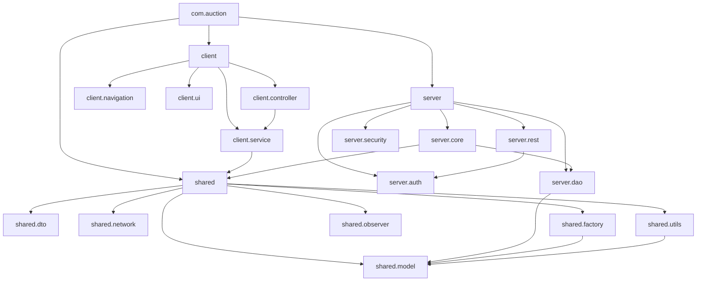
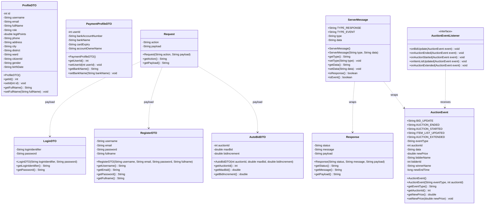
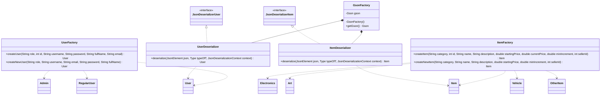
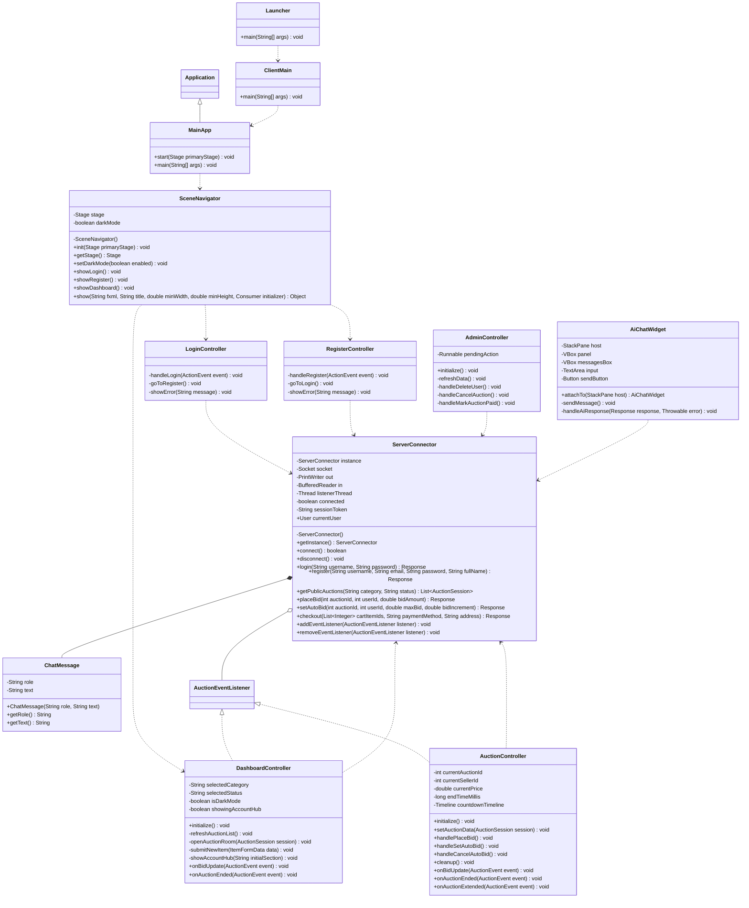

# UML Class Diagram - Online Auction System

Tài liệu này mô tả sơ đồ lớp của hệ thống đấu giá trực tuyến theo tinh thần của UML class diagram: mỗi lớp có tên, thuộc tính, phương thức và quan hệ với lớp khác. Ký hiệu sử dụng:

- `+`: public
- `-`: private
- `#`: protected
- `<|--`: kế thừa
- `<|..`: hiện thực interface
- `..>`: phụ thuộc
- `o--`: aggregation, lớp chứa danh sách/tham chiếu nhưng vòng đời độc lập
- `*--`: composition, lớp sở hữu mạnh thành phần bên trong

## 1. Cấu Trúc Package

## 2. Domain Model

Đây là nhóm lớp trung tâm của hệ thống. `Entity` là lớp trừu tượng gốc; `User` và `Item` là hai nhánh kế thừa chính. Các lớp như `AuctionSession`, `Bid`, `AutoBid`, `CartItem`, `Notification` biểu diễn nghiệp vụ đấu giá.

```mermaid
classDiagram
    class Entity {
        <<abstract>>
        #int id
        #Timestamp createdAt
        +Entity()
        +Entity(int id)
        +getId() int
        +setId(int id) void
        +getCreatedAt() Timestamp
        +setCreatedAt(Timestamp createdAt) void
        +getDisplayInfo() String
    }

    class User {
        <<abstract>>
        #String username
        #String password
        #String fullName
        #String role
        #String email
        #double legitPoints
        #Timestamp bannedUntil
        #int unpaidStrikeCount
        #int paidStreakCount
        #String phone
        #String address
        #String city
        #String district
        #String ward
        #String citizenId
        #String gender
        #String birthDate
        +User()
        +User(int id, String username, String password, String fullName, String email, String role)
        +User(String username, String email, String password, String fullName, String role)
        +getUsername() String
        +setUsername(String username) void
        +getRole() String
        +setRole(String role) void
        +getEmail() String
        +setEmail(String email) void
        +getLegitPoints() double
        +setLegitPoints(double legitPoints) void
        +getDisplayInfo() String
    }

    class Admin {
        +Admin()
        +Admin(int id, String username, String password, String fullName, String email)
        +Admin(String username, String email, String password, String fullName)
        +getDisplayInfo() String
    }

    class RegularUser {
        +RegularUser()
        +RegularUser(int id, String username, String password, String fullName, String email)
        +RegularUser(String username, String email, String password, String fullName)
    }

    class Seller {
        +Seller()
        +Seller(int id, String username, String password, String fullName, String email)
        +Seller(String username, String email, String password, String fullName)
        +getDisplayInfo() String
    }

    class Bidder {
        +Bidder()
        +Bidder(int id, String username, String password, String fullName, String email)
        +Bidder(String username, String email, String password, String fullName)
        +getDisplayInfo() String
    }

    class Item {
        <<abstract>>
        #String name
        #String description
        #String category
        #double startingPrice
        #double currentPrice
        #double minIncrement
        #int sellerId
        #String imagePath
        +Item()
        +Item(int id, String name, String description, String category, double startingPrice, double currentPrice, double minIncrement, int sellerId)
        +Item(String name, String description, String category, double startingPrice, double minIncrement, int sellerId)
        +getName() String
        +setName(String name) void
        +getCategory() String
        +setCategory(String category) void
        +getCurrentPrice() double
        +setCurrentPrice(double currentPrice) void
        +getDisplayInfo() String
        +getCategorySpecificInfo() String
    }

    class Electronics {
        -String brand
        -String warrantyPeriod
        +Electronics()
        +getBrand() String
        +setBrand(String brand) void
        +getWarrantyPeriod() String
        +setWarrantyPeriod(String warrantyPeriod) void
        +getCategorySpecificInfo() String
    }

    class Art {
        -String artist
        -String medium
        +Art()
        +getArtist() String
        +setArtist(String artist) void
        +getMedium() String
        +setMedium(String medium) void
        +getCategorySpecificInfo() String
    }

    class Vehicle {
        -int year
        -String manufacturer
        +Vehicle()
        +getYear() int
        +setYear(int year) void
        +getManufacturer() String
        +setManufacturer(String manufacturer) void
        +getCategorySpecificInfo() String
    }

    class OtherItem {
        +OtherItem()
        +getCategorySpecificInfo() String
    }

    class AuctionSession {
        -int itemId
        -Timestamp startTime
        -Timestamp endTime
        -String status
        -double currentHighestBid
        -int winnerId
        -int sellerId
        -String itemName
        -String winnerName
        -String itemDescription
        -String itemCategory
        -String itemImagePath
        -int bidCount
        -String checkoutStatus
        -Timestamp paymentDueAt
        -Timestamp highlightedUntil
        +AuctionSession()
        +AuctionSession(int id, int itemId, Timestamp startTime, Timestamp endTime, String status, double currentHighestBid, int winnerId)
        +AuctionSession(int itemId, Timestamp startTime, Timestamp endTime)
        +getItemId() int
        +setItemId(int itemId) void
        +getStatus() String
        +setStatus(String status) void
        +getCurrentHighestBid() double
        +setCurrentHighestBid(double currentHighestBid) void
        +isActive() boolean
        +getDisplayInfo() String
    }

    class Bid {
        -int auctionId
        -int userId
        -double bidAmount
        -Timestamp bidTime
        -String bidderName
        +Bid()
        +Bid(int auctionId, int userId, double bidAmount)
        +Bid(int id, int auctionId, int userId, double bidAmount, Timestamp bidTime)
        +getAuctionId() int
        +setAuctionId(int auctionId) void
        +getUserId() int
        +setUserId(int userId) void
        +getBidAmount() double
        +setBidAmount(double bidAmount) void
        +getDisplayInfo() String
    }

    class AutoBid {
        -int auctionId
        -int userId
        -double maxBid
        -double bidIncrement
        -boolean active
        +AutoBid()
        +AutoBid(int auctionId, int userId, double maxBid, double bidIncrement)
        +getAuctionId() int
        +getUserId() int
        +getMaxBid() double
        +getBidIncrement() double
        +isActive() boolean
        +getDisplayInfo() String
    }

    class CartItem {
        -int auctionId
        -int itemId
        -int bidderId
        -String itemName
        -String itemDescription
        -String itemCategory
        -String imagePath
        -double winningPrice
        -String status
        -Timestamp wonAt
        -Timestamp paymentDueAt
        +CartItem()
        +getAuctionId() int
        +getItemId() int
        +getBidderId() int
        +getWinningPrice() double
        +getStatus() String
        +getDisplayInfo() String
    }

    class Notification {
        -int userId
        -String title
        -String message
        -String type
        -int referenceId
        -boolean read
        +Notification()
        +Notification(int userId, String title, String message, String type)
        +getUserId() int
        +getTitle() String
        +getType() String
        +isRead() boolean
        +setRead(boolean read) void
        +getDisplayInfo() String
    }

    class AuctionStatus {
        <<enumeration>>
        OPEN
        RUNNING
        FINISHED
        PAID
        CANCELED
    }

    class ItemCategory {
        <<enumeration>>
        ELECTRONICS
        ART
        VEHICLE
        OTHER
    }

    Entity <|-- User
    User <|-- Admin
    User <|-- RegularUser
    User <|-- Seller
    User <|-- Bidder

    Entity <|-- Item
    Item <|-- Electronics
    Item <|-- Art
    Item <|-- Vehicle
    Item <|-- OtherItem

    Entity <|-- AuctionSession
    Entity <|-- Bid
    Entity <|-- AutoBid
    Entity <|-- CartItem
    Entity <|-- Notification

    User "1" --> "0..*" Item : sellerId
    Item "1" --> "0..*" AuctionSession : itemId
    AuctionSession "1" --> "0..*" Bid : auctionId
    User "1" --> "0..*" Bid : userId
    AuctionSession "1" --> "0..*" AutoBid : auctionId
    User "1" --> "0..*" AutoBid : userId
    AuctionSession "1" --> "0..1" CartItem : winning auction
    User "1" --> "0..*" CartItem : bidderId
    User "1" --> "0..*" Notification : userId
    AuctionStatus ..> AuctionSession : status values
    ItemCategory ..> Item : category values
```

## 3. DTO, Network Và Observer

Nhóm lớp này giúp client và server trao đổi dữ liệu qua JSON. DTO chỉ mang dữ liệu cần truyền, còn `Request`, `Response`, `ServerMessage` là wrapper cho giao tiếp socket/REST. `AuctionEventListener` là interface của Observer pattern.

## 4. Factory, Serialization Và Shared Utilities

`UserFactory` và `ItemFactory` tạo object con nhưng trả về kiểu cha (`User`, `Item`). Đây là điểm quan trọng để chứng minh tính đa hình. `GsonFactory` giải quyết việc deserialize các lớp trừu tượng khi truyền JSON.

## 5. Server Core, DAO, Auth Và REST

Đây là nhóm lớp xử lý nghiệp vụ chính. `ClientHandler` nhận request từ client, gọi DAO/service tương ứng và trả response. `AuctionScheduler` chạy nền để chuyển trạng thái phiên đấu giá. `ClientManager` broadcast event thời gian thực.

```mermaid
classDiagram
    class ServerMain {
        -ServerSocket serverSocket
        -RestApiServer REST_API_SERVER
        +main(String[] args) void
        -resolvePort() int
        -shutdownServer() void
    }

    class ClientHandler {
        -Socket clientSocket
        -PrintWriter out
        -BufferedReader in
        #User currentUser
        +ClientHandler(Socket socket)
        +run() void
        -processRequest(Request request) Response
        -handleLogin(String payload) Response
        -handleRegister(String payload) Response
        -handleAddItem(String payload) Response
        -handlePlaceBid(String payload) Response
        -handleSetAutoBid(String payload) Response
        -handleCheckout(String payload) Response
        +sendRawMessage(String jsonMessage) void
    }

    class ClientManager {
        -Set~ClientHandler~ connectedClients
        -ClientManager()
        +getInstance() ClientManager
        +addClient(ClientHandler client) void
        +removeClient(ClientHandler client) void
        +broadcastToAll(AuctionEvent event) void
        +broadcastEvent(AuctionEvent event) void
        +getConnectedCount() int
    }

    class AuctionScheduler {
        -AuctionScheduler instance
        -ScheduledExecutorService scheduler
        -AuctionScheduler()
        +getInstance() AuctionScheduler
        +start() void
        -checkAuctions() void
        -finishAuction(AuctionSession session) void
        +stop() void
    }

    class AutoBidManager {
        -int MAX_AUTO_BID_STEPS
        +processAutoBids(int auctionId, int currentBidderId, double currentPrice) void
        +selectNextAutoBid(List~AutoBid~ autoBids, int currentBidderId, double currentPrice) AutoBid
        +calculateNextBid(AutoBid autoBid, double currentPrice) double
        +isValidAutoBid(AutoBid autoBid) boolean
    }

    class LoginService {
        -UserDAO userDAO
        +LoginService()
        +authenticate(String loginIdentifier, String password) Optional~User~
    }

    class SessionRegistry {
        -ConcurrentHashMap sessions
        -SecureRandom secureRandom
        -Duration ttl
        +getInstance() SessionRegistry
        +createSession(User user) SessionToken
        +validate(String token) Optional~User~
        +revoke(String token) boolean
        +clearExpired() void
    }

    class PasswordHasher {
        -String PREFIX
        -String ALGORITHM
        -int ITERATIONS
        +hash(String password) String
        +verify(String password, String stored) boolean
        +isHash(String value) boolean
    }

    class RestApiServer {
        -HttpServer server
        -ExecutorService executor
        +start() void
        +stop() void
        -resolvePort() int
    }

    class AuthRestHandler {
        -LoginService loginService
        -SessionRegistry sessionRegistry
        +handle(HttpExchange exchange) void
        -handleLogin(HttpExchange exchange) void
        -handleLogout(HttpExchange exchange) void
    }

    class ChatRestHandler {
        -HttpClient httpClient
        +handle(HttpExchange exchange) void
        -buildGeminiRequest(JsonArray messages) JsonObject
        -extractAnswer(String body) String
        -readGeminiError(String body) String
    }

    class DatabaseConnection {
        -String URL
        -String USER
        -String PASSWORD
        +getConnection() Connection
        +ensureSchemaUpdates() void
    }

    class UserDAO {
        +registerUser(User user) boolean
        +loginUser(String loginIdentifier, String password) User
        +getUserById(int id) User
        +getAllUsers() List~User~
        +deleteUser(int userId) boolean
        +isBidderBanned(int userId) boolean
        +applyPaidReward(int userId) boolean
        +applyUnpaidPenalty(int userId) boolean
        +getProfile(int userId) ProfileDTO
        +updateProfile(int userId, ProfileDTO profile) boolean
    }

    class ItemDAO {
        +getAllItems() List~Item~
        +getItemById(int id) Item
        +getItemsBySellerId(int sellerId) List~Item~
        +addItem(Item item) int
        +updateItem(Item item) boolean
        +deleteItem(int itemId, int sellerId) boolean
    }

    class AuctionSessionDAO {
        +createAuction(AuctionSession session) int
        +getPublicAuctions(String category, String statusGroup) List~AuctionSession~
        +getAuctionById(int id) AuctionSession
        +updateStatus(int auctionId, String newStatus) boolean
        +setWinner(int auctionId, int winnerId) boolean
        +extendEndTime(int auctionId, Timestamp newEndTime) boolean
        +cancelAuction(int auctionId) boolean
        +markPaid(int auctionId) boolean
        +relistAuction(int oldAuctionId, String name, String description, String imagePath) int
    }

    class BidDAO {
        +placeBid(int auctionId, int userId, double bidAmount) String
        +validateBid(String status, Timestamp endTime, double currentHighestBid, double minIncrement, double bidAmount) String
        +getBidHistory(int auctionId) List~Bid~
        +getHighestBid(int auctionId) double
        +getHighestBidderId(int auctionId) int
    }

    class AutoBidDAO {
        +createAutoBid(AutoBid autoBid) int
        +getActiveAutoBids(int auctionId) List~AutoBid~
        +deactivateAutoBid(int autoBidId) boolean
        +deactivateUserAutoBids(int auctionId, int userId) boolean
        +getUserAutoBid(int auctionId, int userId) AutoBid
    }

    class CartDAO {
        +addWonItem(AuctionSession session, int bidderId) boolean
        +getCartItems(int bidderId) List~CartItem~
        +checkout(int bidderId, List~Integer~ cartItemIds, String paymentMethod, String address) boolean
        +getOverduePendingItems() List~CartItem~
        +cancelOverdue(int cartItemId) boolean
    }

    class NotificationDAO {
        +create(Notification notification) boolean
        +getByUser(int userId) List~Notification~
        +markAllRead(int userId) boolean
    }

    class AuctionParticipantDAO {
        +ensureSellerParticipant(int auctionId, int userId) boolean
        +ensureBidderParticipant(int auctionId, int userId) boolean
        +getRoomRole(int auctionId, int userId) String
    }

    Runnable <|.. ClientHandler
    HttpHandler <|.. AuthRestHandler
    HttpHandler <|.. ChatRestHandler

    ServerMain *-- RestApiServer
    ServerMain ..> ClientHandler
    ServerMain ..> AuctionScheduler
    ServerMain ..> DatabaseConnection
    ClientManager o-- ClientHandler
    ClientManager ..> AuctionEvent
    ClientHandler ..> LoginService
    ClientHandler ..> SessionRegistry
    ClientHandler ..> UserDAO
    ClientHandler ..> ItemDAO
    ClientHandler ..> AuctionSessionDAO
    ClientHandler ..> BidDAO
    ClientHandler ..> AutoBidDAO
    ClientHandler ..> CartDAO
    ClientHandler ..> NotificationDAO
    ClientHandler ..> ClientManager
    ClientHandler ..> UserFactory
    ClientHandler ..> ItemFactory
    AuctionScheduler ..> AuctionSessionDAO
    AuctionScheduler ..> BidDAO
    AuctionScheduler ..> CartDAO
    AuctionScheduler ..> NotificationDAO
    AutoBidManager ..> AutoBidDAO
    AutoBidManager ..> BidDAO
    AutoBidManager ..> ClientManager
    LoginService ..> UserDAO
    UserDAO ..> PasswordHasher
    UserDAO ..> UserFactory
    ItemDAO ..> ItemFactory
    UserDAO ..> DatabaseConnection
    ItemDAO ..> DatabaseConnection
    AuctionSessionDAO ..> DatabaseConnection
    BidDAO ..> DatabaseConnection
    AutoBidDAO ..> DatabaseConnection
    CartDAO ..> DatabaseConnection
    NotificationDAO ..> DatabaseConnection
    AuctionParticipantDAO ..> DatabaseConnection
    RestApiServer *-- AuthRestHandler
    RestApiServer *-- ChatRestHandler
    AuthRestHandler ..> LoginService
    AuthRestHandler ..> SessionRegistry
```

## 6. Client UI Và Giao Tiếp

Client dùng JavaFX/FXML. Controllers không truy cập database trực tiếp mà đi qua `ServerConnector`. `DashboardController` và `AuctionController` implement `AuctionEventListener` để nhận event realtime.

## 7. Ma Trận Quan Hệ Chính

| Quan hệ | Lớp tham gia | Ý nghĩa trong hệ thống |
| --- | --- | --- |
| Generalization | `Entity` -> `User`, `Item`, `AuctionSession`, `Bid`, `AutoBid`, `CartItem`, `Notification` | Các entity có chung `id`, `createdAt`, `getDisplayInfo()`. |
| Generalization | `User` -> `Admin`, `RegularUser`, `Seller`, `Bidder` | Mô hình hóa các loại người dùng. Tài khoản runtime hiện chủ yếu dùng `ADMIN` và `USER`; vai trò phòng đấu giá lưu riêng ở `auction_participants`. |
| Generalization | `Item` -> `Electronics`, `Art`, `Vehicle`, `OtherItem` | Mỗi loại sản phẩm có thông tin chuyên biệt qua `getCategorySpecificInfo()`. |
| Realization | `DashboardController`, `AuctionController` -> `AuctionEventListener` | Controller nhận callback khi có bid mới, phiên kết thúc, phiên bắt đầu hoặc danh sách thay đổi. |
| Realization | `ClientHandler` -> `Runnable` | Mỗi kết nối client chạy trong một worker thread. |
| Realization | `AuthRestHandler`, `ChatRestHandler` -> `HttpHandler` | REST endpoint xử lý request HTTP. |
| Association | `AuctionSession` - `Item` | Mỗi phiên gắn với một sản phẩm qua `itemId`. |
| Association | `Bid`, `AutoBid` - `AuctionSession` - `User` | Bid và auto-bid gắn với phiên và người đặt giá. |
| Association | `CartItem` - `AuctionSession` - `User` | Item thắng đấu giá được đưa vào giỏ hàng của bidder. |
| Aggregation | `ClientManager` o-- `ClientHandler` | Manager giữ tập client đang kết nối để broadcast event. |
| Aggregation | `ServerConnector` o-- `AuctionEventListener` | Client connector giữ danh sách listener để thông báo UI. |
| Composition | `RestApiServer` *-- `AuthRestHandler`, `ChatRestHandler` | REST server tạo và quản lý handler cho endpoint. |
| Dependency | DAO -> `DatabaseConnection` | Mọi DAO mở connection qua lớp cấu hình chung. |
| Dependency | `ClientHandler` -> DAO/service/factory | Socket handler điều phối request tới nghiệp vụ và persistence. |

## 8. Danh Sách Lớp Theo Package

| Package | Lớp |
| --- | --- |
| `com.auction.client` | `ClientMain`, `Launcher`, `MainApp` |
| `com.auction.client.controller` | `AdminController`, `AuctionController`, `DashboardController`, `LoginController`, `RegisterController` |
| `com.auction.client.navigation` | `SceneNavigator` |
| `com.auction.client.service` | `ServerConnector`, `ServerConnector.ChatMessage` |
| `com.auction.client.ui` | `AiChatWidget` |
| `com.auction.server` | `ServerMain` |
| `com.auction.server.auth` | `LoginService`, `SessionRegistry`, `SessionRegistry.Session`, `SessionRegistry.SessionToken` |
| `com.auction.server.core` | `AuctionScheduler`, `AutoBidManager`, `ClientHandler`, `ClientManager` |
| `com.auction.server.dao` | `AuctionParticipantDAO`, `AuctionSessionDAO`, `AutoBidDAO`, `BidDAO`, `CartDAO`, `DatabaseConnection`, `ItemDAO`, `NotificationDAO`, `UserDAO` |
| `com.auction.server.rest` | `AuthRestHandler`, `ChatRestHandler`, `JsonHttpUtils`, `RestApiServer` |
| `com.auction.server.security` | `PasswordHasher` |
| `com.auction.shared.dto` | `AutoBidDTO`, `LoginDTO`, `PaymentProfileDTO`, `ProfileDTO`, `RegisterDTO` |
| `com.auction.shared.factory` | `ItemFactory`, `UserFactory` |
| `com.auction.shared.model` | `Admin`, `Art`, `AuctionSession`, `AuctionStatus`, `AutoBid`, `Bid`, `Bidder`, `CartItem`, `Electronics`, `Entity`, `Item`, `ItemCategory`, `Notification`, `OtherItem`, `RegularUser`, `Seller`, `User`, `Vehicle` |
| `com.auction.shared.network` | `Request`, `Response`, `ServerMessage` |
| `com.auction.shared.observer` | `AuctionEvent`, `AuctionEventListener` |
| `com.auction.shared.utils` | `GsonFactory`, `GsonFactory.UserDeserializer`, `GsonFactory.ItemDeserializer` |

## 9. Tài Liệu Tham Khảo

- [Biểu đồ lớp UML - Viblo](https://viblo.asia/p/bieu-do-lop-uml-Az45bDaVZxY)
- [Visual Paradigm UML Class Diagram Tutorial](https://www.visual-paradigm.com/guide/uml-unified-modeling-language/uml-class-diagram-tutorial/)
